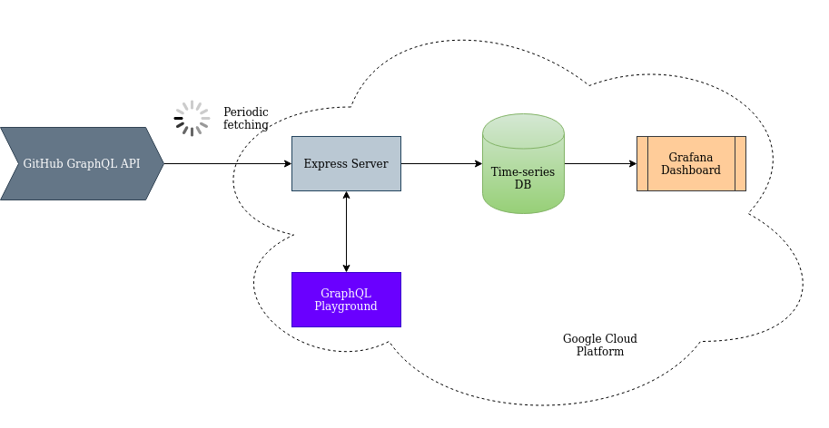

# github-hall-of-fame
Dashboard to monitor the ranking of the GitHub most popular languages and users.


## Introduction

GitHub provides us with two API versions: [the version 3 RESTful API](https://developer.github.com/v3/), and [the version 4 implementing the GraphQL](https://developer.github.com/v4/) query language.

In this project, we'll be using the v4 GraphQL API to periodically fetch the 100 most popular projects on GitHub in terms of stars count, we'll then store this data in a time-series database, and aggregate it on a dashboard to follow the evolution over time of:
- The most popular languages by stars count
- The most popular users
- The users with most forks across their repositories.


#### Tech Stack
- Development: Docker, Node.js, Express, GraphQL Client, GraphQL Playground, InfluxDB, Grafana.
- Deployment: Compute Engine VM on Google Cloud Platform.

#### Why use the GraphQL API instead of the REST API?

Although a REST client is easier to setup, GraphQL offers certain advantages:

- All data obtained in one query, and from one endpoint.
- Reduce the network traffic, which leads to a lower cloud provider bill at the end of the month.
- Project is future-proof, as the v3 REST API will be discontinued in the future.


## Architecture

Basic micro-services architecture that encapsulates each part of the pipe in a Docker container. All services are described in a docker-compose file ([local](./docker-compose.local.yaml), [live](./docker-compose.live.yaml)).

These services are:
- Express server: Connects to the GraphQL API using the [Apollo Client](https://www.apollographql.com/docs/react/), and serves the [GraphQL Playground](https://github.com/prisma-labs/graphql-playground) for testing queries in the scope provided by your API token.
- Time-series Database: We use [InfluxDB](https://www.influxdata.com/products/influxdb-overview/) as it is nowadays an industry-standard for fast and efficient storage and retrieval of time-related measurements.




#### Important configuration notes

The configuration for this project is set in the file [config/config.json](./config/config.json), and main configuration elements are:

- GitHub GraphQL API URL `github-api.url` set to https://api.github.com/graphql.
- Data fetching period `default.interval-mn` set to **15 minutes**.
- Pagination page size `default.pagination-page-size` set to 100, which the limit authorized by the GitHub API.


## Methodology, or a step-by-step description of the development process

0. **Poke around in the Playground provided by GitHub**: Login and start playing around at [this link](https://developer.github.com/v4/explorer/).

1. **Get Access Token**: GitHub can provide users with access tokens with a specific scope for their projects to access its APIs. We generate a token with a limited read-only scope. Good to know: Tokens unused in a 1-year period are automatically removed.

2. **Setup a development playground for testing queries**: [Branch [feature/add-graphql-playground](https://github.com/redouane-dev/github-hall-of-fame/tree/feature/add-graphql-playground)] We use the [Express Middleware provided by Prisma Labs](https://github.com/prisma-labs/graphql-playground/tree/master/packages/graphql-playground-middleware-express) and link it to the endpoint `/playground` of our Express server.

3. **Dockerize the Application**: [Branch [feature/docker-application](https://github.com/redouane-dev/github-hall-of-fame/tree/feature/dockerize-application)] Wrap services in a container for easy development, deployment, scaling, and maintenance.

4. **Integrate GraphQL Client**: [Branch [feature/integrate-graphql-client](https://github.com/redouane-dev/github-hall-of-fame/tree/feature/integrate-graphql-client)] Wrap the [React client provided by Apollo](https://www.apollographql.com/docs/react/) in a class to connect and asynchronously fetch data from the GitHub GraphQL endpoint.

5. **Integrate InfluxDB**: [Branch [feature/integrate-influxdb](https://github.com/redouane-dev/github-hall-of-fame/tree/feature/integrate-influxdb-database)] Add the InfluxDB service and connect to it using the [node-influx](https://node-influx.github.io/) Node.js client.

6. **Add Grafana service**: [Branch [feature/add-grafana-service](https://github.com/redouane-dev/github-hall-of-fame/tree/feature/add-grafana-service)] Grafana Labs provide an [official image that can be easily setup](https://grafana.com/docs/grafana/latest/installation/docker/).

7. **Enjoy the dashboard** 😎: Once all services running, Grafana can be configured to connect to InfluxDB, and panels can be setup to display all sorts of aggregated data. For a quick setup with the same panels as the [dashboard above](https://futurice.redouaneachouri.com/d/w_AGnSZGk/github-hall-of-fame?orgId=1&from=now-24h&to=now), a pre-saved dashboard model [github-hall-of-fame-dashboard.json](./docs/github-hall-of-fame-dashboard.json) can be imported from your local Grafana homepage. (See instructions [here](https://grafana.com/docs/grafana/latest/reference/export_import/))

8. **Enable SSL Encryption (optional)**: [Branch [feature/add-reverse-proxy](https://github.com/redouane-dev/github-hall-of-fame/tree/feature/add-reverse-proxy)] We use Nginx as a reverse proxy to redirect requests on the GCP live server towards HTTPS, and assign free certificates from [Let's Encrypt](https://letsencrypt.org/).

## Deployment and testing

### Local

1. Clone this repo and `cd` into it:
```bash
# Using SSH
git clone git@github.com:redouane-dev/github-hall-of-fame.git

cd github-hall-of-fame
```

2. Set your GitHub API token in file [config/secret.json](./config/secret.json). If this project was sent to you via email, then most likely the token is joined in the email body and you don't need to generate your own.

3. For local deployment, use the [docker-compose.local.yaml](./docker-compose.local.yaml) to start the services:
```bash
# Create docker network
docker network create project-github-hall-of-fame-network

# Start services
docker-compose -f docker-compose.local.yaml up -d  # The -d for detached mode
```

**Note**: Local version uses [Nodemon](https://www.npmjs.com/package/nodemon) to automatically restart the server in case of file change, so you won't need to manual perform a restart.

You may see in the logs of the server a message saying:
```
Error creating database 'github: Error: connect ECONNREFUSED 172.20.0.4:8086
```
... which is normal since the server attempts a first connection to the InfluxDB service, but cannot find it since Influx takes some time to start. This will resolve by itself as soon as the DB becomes available.

Another well-known issue is the lack of permissions on the `./persistence` directory created at contianer startup, which is used to persist data from InfluxDB and Grafana containers into local disk. To solve this, grant permissions with:
```bash
sudo chmod -R a+rwx persistence
```

4. To fetch data using the GraphQL Playground, connect to http://localhost:4000/playground and run the following query:

__Note__: Make sure the headers section at the bottom contains your header in the following form:
```json
{
  "Authorization": "Bearer <your-token>"
}
```

Query:
```
query {
    search(query: "is:public stars:>1000", type: REPOSITORY, first: 10) {
        nodes {
            ... on Repository {
                name
                url
                stargazers {
                    totalCount
                }
                forks {
                    totalCount
                }
                owner {
                    login
                }
                primaryLanguage {
                    name
                }
            }
        }
    }
}
```

5. To check if data is fetched and stored correctly on the DB, you may increase the fetching frequency to 1 minute in the field `interval-mn` of the config file, then connect to the DB with:

```bash
# Connect a terminal with the DB service
docker exec -it project-github-hall-of-fame-influxdb bash

# Start an Influx prompt
influx -precision rfc339

# Perform any type of query with the InfluxQL query laguage
USE github;

SELECT * FROM repositories LIMIT 10;
```

6. To visualize data in the local dashboard:
  - Connect to http://localhost:3000/
  - Login with the default creds `admin:admin` (you'll be prompted to setup a proper password).
  - From the configuration panel, create a data source by selecting `InfluxDB`, and by setting the host to http://influxdb:8086/, and the Database to `github`. Save and return to the home page.
  - Import the pre-made dashboard by uploading the file [docs/github-hall-of-fame-dashboard.json](./docs/github-hall-of-fame-dashboard.json).
  - The dashboard might be empty at the beginning, but it will fill-up as the server will load more and more data (with a higher frequency, as mentioned in the previous point 5.)


### Live

- This project is deployed on a [GCP Compute Engine](https://cloud.google.com/compute) vurtual machine running Debian 10.
- Nginx is setup as a reverse proxy to enable SSL encyption and redirect requests to HTTPS. The proxy service can be found under directory [nginx-proxy](./nginx-proxy).
- The live services description can be found in file [docker-compose.live.yaml](./docker-compose.live.yaml)


## Future improvements
- Add asynchronious pagination to fetch more than a 100 elements from the GitHub API, which is the current authorized limit.
- Alter the retention policy on InfluxDB to keep only the recent records and thus limit the disk space consumption.
- Improve exceptions handling.
- Add automatic tests.


## Useful links
- [Forming Calls with GraphQL](https://developer.github.com/v4/guides/forming-calls/)
- [
Using the Explorer](https://developer.github.com/v4/guides/using-the-explorer/)
- [InfluxDB key concepts](https://docs.influxdata.com/influxdb/v1.8/concepts/key_concepts/)
- [Import and Export a Grafana dashboard](https://grafana.com/docs/grafana/latest/reference/export_import/)
